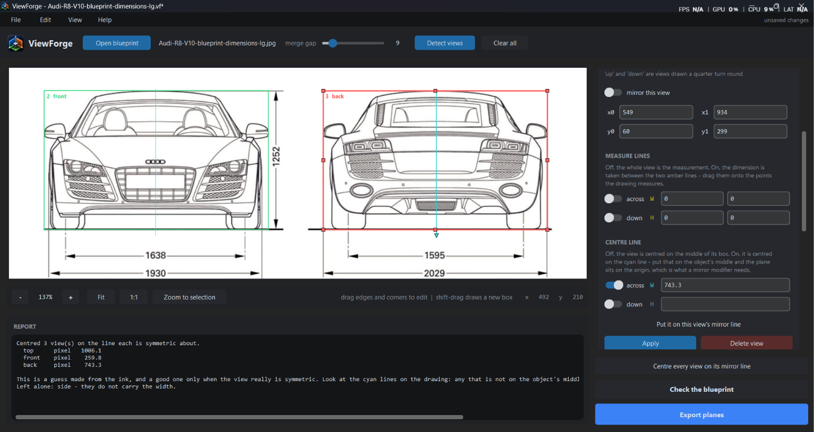
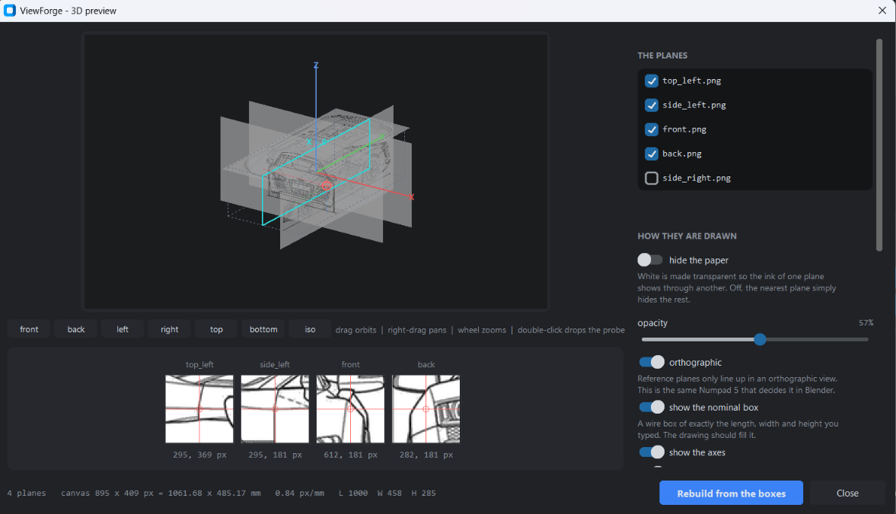

<a href='https://ko-fi.com/I3I01ADVKL' target='_blank'></a>

# ViewForge

Turns a multi-view blueprint into orthographic reference planes that actually
line up in Blender, and prints the numbers to place them with.

Point it at a drawing with a side, top and front view on it. Tell it which is
which and how big the object is. It writes one PNG per view, all on a shared
canvas, plus a Blender script that builds the planes for you. Then it measures
its own output files and tells you how far off they came out.

- **Every view shares one canvas**, so one Size and one Offset apply to all of
  them and only rotation differs. Per-view Size values are the easiest thing in
  this process to get wrong.
- **It checks its own work.** Extents are re-measured from the written PNGs, not
  from the export's own arithmetic.
- **It does not guess quietly.** A drawing that is out of square, two views that
  disagree about the object's centre line, a measure line left somewhere odd:
  you get told, and nothing is silently corrected on your behalf.
- **It draws the planes as the drawing was drawn.** Colour, shading and filled
  areas survive instead of collapsing into a black silhouette.
- **It puts the object on the origin.** Centre lines say where each view's
  middle really is, and the planes are placed around it to the sub-pixel, so a
  mirror modifier folds onto your reference instead of missing it.
- **You can look before you leap.** The 3D preview puts the planes in space and
  lets you drop a probe on a feature, so you find out whether the views agree
  before you have modelled anything.
- **Your work is a file.** Boxes, measure lines, roles, sizes and settings save
  to a `.vf` project you can reopen and carry on with.

---

## Screenshots


**The main window.** A blueprint loaded, views detected, roles assigned, and the
report showing what the numbers imply.


**Editing a box.** Drag any edge on its own, a corner to move two, or the middle
to move the whole thing.



**Centre lines.** The cyan line is where the object's middle actually is, which
is not the middle of the box whenever anything in the drawing is lopsided. That
line is what lands on X=0, and it is what a mirror modifier folds about.



**The 3D preview.** The planes in space before anything is written, with the
probe dropped on a feature. Every plane shows where that same point lands on it,
magnified, along the bottom. Same feature under every crosshair means the views
agree.


**The result in Blender.** Planes built by the generated import script, centred
on the world origin and lined up with each other.

---

## Requirements

| | |
|---|---|
| **Python** | 3.9 or newer (developed on 3.14) |
| **OS** | Windows, macOS or Linux |
| **Packages** | `pillow`, `numpy`, `scipy`, `customtkinter` |
| **Tkinter** | Ships with Python on Windows and macOS. On Linux you install it separately, see below. |
| **Blender** | Any version with image empties. The Size figure was verified on 5.2. |

Exact versions are in [`requirements.txt`](requirements.txt).

## Installation

### 1. Get Python

Check what you have:

```bash
python --version
```

If that fails, or reports anything below 3.9, install Python from
[python.org/downloads](https://www.python.org/downloads/). **On Windows, tick
"Add python.exe to PATH"** on the first screen of the installer. Almost every
"python is not recognized" problem starts there.

On Linux you also need Tkinter, which is not a pip package:

```bash
sudo apt install python3-tk        # Debian / Ubuntu
sudo dnf install python3-tkinter   # Fedora
sudo pacman -S tk                  # Arch
```

### 2. Get ViewForge

```bash
git clone https://github.com/micahzgreat/ViewForge.git
cd ViewForge
```

Or download the ZIP from the green **Code** button and extract it.

### 3. Install the packages

A virtual environment keeps these out of your system Python. Recommended, not
required.

**Windows (PowerShell):**

```powershell
python -m venv .venv
.\.venv\Scripts\Activate.ps1
pip install -r requirements.txt
```

If PowerShell blocks the activate script, allow it for this user once:
`Set-ExecutionPolicy -Scope CurrentUser RemoteSigned`

**macOS / Linux:**

```bash
python3 -m venv .venv
source .venv/bin/activate
pip install -r requirements.txt
```

**Without a virtual environment**, just the last line on its own is enough.

### 4. Run it

```bash
python viewforge_gui.py
```

You should get a dark window with a **ViewForge** logo in the top left. If
Python starts and nothing appears, Tkinter is missing. See step 1.

---

## Workflow

1. **Open blueprint.** Any image with several views of one object on it.
   Colour, shading and filled areas are all fine.
2. **Detect views.** Each blob of ink becomes a candidate region. If the tool
   says it merged everything into one region, the blueprint's dimension lines
   are joining the views together. Pull the boxes apart by hand, or draw your
   own.
3. **Adjust the boxes.** Every box is editable, detected ones included.
4. **Assign roles.** Select each region, set its role (side / top / bottom /
   front / back), and say which edge the object's **front** sits against.
   Anything left on `ignore` is skipped, which is how you exclude detail insets,
   title blocks and parts diagrams.
5. **Put them on the origin.** Press **Centre every view on its mirror line**,
   then check the cyan lines are on the object's middle. Skip this and a mirror
   modifier will not fold onto your reference.
6. **Enter dimensions.** Length, width and height in mm. Or switch on
   **proportional only** and skip them entirely.
7. **Check the blueprint.** Read the warnings before exporting.
8. **Preview it in 3D.** Walk round the planes, drop the probe on a feature,
   and see whether every view puts it in the same place.
9. **Export planes.** Pick a folder. Everything lands in it.

## Controls

Click the canvas once so it has keyboard focus.

| Action | Control |
|---|---|
| Draw a new box | Drag on empty paper |
| Draw a box **over** an existing one | **Shift** + drag |
| Move one edge | Drag that edge |
| Move a corner (two edges at once) | Drag that corner |
| Move a whole box | Drag the middle of the **selected** box |
| Move a measure line | Drag its amber diamond |
| Move a centre line | Drag its cyan tab |
| Select a view | Click it, or click its row in the list |
| Delete the selected view | **Delete** |
| Zoom | Wheel, or **+** / **-** |
| Pan | Middle-drag, right-drag, **Ctrl**+drag, or arrow keys |
| Fit to window | **F** |
| Undo / redo | **Ctrl+Z** / **Ctrl+Y** |
| 3D preview | **Ctrl+P** |
| Save the project | **Ctrl+S** |

## Editing boxes

Handles appear on the selected box: four corners, four edge midpoints. The
pointer changes shape over each one.

Editing an **auto-detected** region turns it into a hand box, and the report
says so when it happens. It has to. A detected region measures its own blob of
ink and ignores its rectangle, so a rectangle you had just dragged would have
done nothing at all. Once it is a box, the rectangle is the measurement.

For a hand-drawn box **the box is the measurement**. Put its edges exactly on
the object's extremes, because the tool takes the box width as your stated
length and the box height as your stated height. Ink outside the box is clipped,
which is how you keep annotation text and neighbouring views out.

Edges pushed past the edge of the blueprint get pulled back onto it. They cannot
be left there. An edge hanging off the image would be measured at its stated
position while only the ink inside it actually got used, and that is a scale
error with nothing on screen to reveal it.

## Measure lines

Sometimes the figure on the drawing is not taken between the object's extremes.
It is a shoulder, a bore centre, a face set back from the silhouette. Boxing the
object gives you the right picture and the wrong scale. Boxing the measured
points gives you the right scale and throws away the rest of the view.

Switch on **measure lines** for the selected view and you get both. Two amber
guides appear on the axis you asked for. Drag them onto the two points your
dimension is actually taken between. The stated dimension now refers to the gap
between the lines, and the exported plane still shows the whole view running
past them.

- They start out sitting exactly on the box edges, so switching them on changes
  nothing until you move one.
- Their grab handles are the amber diamonds just outside the box, so a measure
  line sitting on top of a box edge is still separately grabbable.
- They are marks on the drawing, so moving a box **edge** leaves them where they
  are. Moving the **whole box** brings them along.
- A line that ends up outside its own box is allowed, but you get a warning. It
  is far more often a leftover than an intention.

The views list marks a gauged view with `g` (across) and `G` (down).

## Views drawn the wrong way round

**front of object is at** takes `left`, `right`, `up` and `down`. The first two
are the ordinary cases. `up` and `down` are for a view drawn a quarter turn
round, where the object's length runs down the image instead of across it. The
tool swaps which of your three dimensions it measures on which image axis, and
rotates the plane to match in Blender.

The control is switched off for **front** and **back** views. On those the
object's front faces the viewer, so the question has no answer, and a live
dropdown there would only invite a setting that does nothing.

> A front or back view that is itself drawn a quarter turn round is not
> currently handled.

## Centre lines, and the mirror modifier

Most people model half an object and let a mirror modifier make the other half.
That folds about **X=0**, so the object's middle has to be exactly there. If the
planes put it 50 mm to one side, the two halves meet 100 mm apart and nothing
you do to the mesh will fix it.

By default every view is centred on the middle of its own box. That is a good
guess and a bad guarantee: the middle of a box is the middle of the *ink*, and
the middle of the ink is only the middle of the *object* when the drawing is
perfectly even. One wing mirror caught by the box and not the other, a dimension
arrow, an edge drawn a shade heavier, a box dragged a few pixels wide on one
side - any of those moves it. On a stock car blueprint the error runs to tens of
millimetres, and the views disagree with each other by more.

**Centre lines** are how you say where the middle actually is. Switch one on for
the selected view and a cyan line appears, with a tab on the opposite side of
the box from the amber measure-line diamonds. Drag it onto the object's middle.
That line, not the box, is then what the plane is centred on.

**Centre every view on its mirror line** does the whole job in one press. For
each view that carries the width it finds the line that view was drawn symmetric
about and puts the centre line there. On the Mustang blueprint in the
screenshots that moves the worst view from **93 mm off X=0 to 1 mm**, which is
under one canvas pixel.

It is a guess made from the ink, though, and a good one only when the view
really is symmetric. So look at the cyan lines afterwards. Any that is not on
the object's middle, drag it there.

Then check it in the **3D preview**: switch on **show the mirror plane** and
look down the front view. The object's middle should sit on the cyan `X = 0`
line. That is the same question Blender will ask you, asked before you have
built anything.

- Only views that carry the width have a middle worth setting - `front`, `back`,
  `top` and `bottom`. A `side` view shows length and height, and the control
  says so rather than pretending otherwise.
- The centre line moves with the box when you drag the whole box, and stays put
  when you drag a single edge, exactly like a measure line.
- The report says how far each plane was deliberately shifted, and the
  verification pass takes that back out before grading the export, so a view
  centred on purpose is never read as a view that missed.
- The views list marks a centred view with `c` (across) and `C` (down).

**Check the blueprint** prints exactly how far each view's centre is from the
line its own ink suggests, in millimetres. Work against that number: anything
more than a millimetre or two will show up against a mirror modifier.

### Down to the pixel

Getting the centre line right is only half of it - the plane then has to be
*rendered* around it exactly.

Each view is resampled straight onto the canvas from a floating-point region of
the blueprint, chosen so its centre falls on the canvas's own geometric centre.
Nothing is cropped to whole pixels and nothing is pasted at a rounded offset.
That matters more than it sounds: the old way left a perfectly symmetric object
up to **0.8 of a canvas pixel** off its own mirror line, by a different amount in
every view, because the amount depended on where the object's middle happened to
fall between two source pixels. Feed a symmetric drawing in now and the exported
plane is bit-for-bit identical to its own mirror image.

The canvas is also **odd on both sides**, so X=0 and Z=0 land on the middle of a
pixel rather than on the seam between two. Either is exactly symmetric, but only
one of them can be pointed at: zoom in on an odd canvas and the centre column of
pixels *is* the mirror line. `report.txt` says which pixel that is.

> Earlier versions applied the mirror line silently, and each view was shifted
> by its own amount with no way to see or correct it - so a misread on one view
> pulled it off the others, and the self-check subtracted the intended shift
> before measuring and graded itself perfect. Centre lines are the same idea
> made visible and editable: seeded by the same measurement, shown on the
> drawing, moved by hand when the guess is wrong, and reported rather than
> hidden. If you have exports from before centre lines existed, redo them.

## No real dimensions

**Proportional only** switches off length, width and height entirely. Sizes come
from the drawing instead. One scale for the whole blueprint, so what you get is
the blueprint's own proportions, with the object scaled so its largest side is
1000 mm. Views measuring the same axis are combined with a median, so one badly
placed box cannot run away with the result. Measure lines still apply.

This is for modelling something accurately and in proportion when its real world
size is not the point. Everything lines up in Blender exactly as it otherwise
would. Nothing in the export is a measurement, and the report says so rather
than leaving a set of authoritative-looking millimetres lying around.

## Output settings

**detail.** `normal` gives roughly one exported pixel per pixel of the
blueprint, which is about all a scan can justify. `draft` halves it, `fine`
doubles it. The canvas is held between 500 and 6000 px, so neither a wall-sized
drawing nor a thumbnail-sized object produces something unusable. Margin is not
a setting. It is fixed just above 1.0, and the canvas grows on its own whenever
centring a view would otherwise push it over the edge.

**scaling.** `fit` stretches each axis of each view independently to hit your
numbers exactly, so the planes always line up. `uniform` keeps one scale per
view, so circles stay round and any disagreement between views stays visible
instead of being hidden. Use `uniform` when the object has round parts you must
model, like wheels or bores. Use `fit` when alignment matters more than fidelity
to the drawing.

**how the planes are drawn.** `as drawn`, `grey` or `line art`. See below.

## Colour, fills and how the planes are drawn

A blueprint is not always black lines on white paper. Plenty are shaded, or
coloured, or have solid filled areas. **How the planes are drawn**, under
Output, decides what survives:

| | |
|---|---|
| **as drawn** | The drawing as it is, with the paper lifted to white. Keeps colour and every filled area. The default, and what a shaded or coloured blueprint needs. |
| **grey** | The same thing flattened to greyscale. Smaller files, and easier to see your own model against. |
| **line art** | Every mark flattened to solid black. Correct for a clean line drawing, and only for that. |

`line art` is what earlier versions always did, and on a drawing with colour or
fills in it the result is a black blob: a red car body and the outline drawn
around it are equally "a mark", so the whole view exports as one silhouette. If
you have exports from before this option existed and they came out solid black,
that is why. Redo them.

The ink pass reads colour properly too. It measures each pixel's distance from
the paper colour in whichever channel is furthest, rather than how dark it is,
because a pale yellow panel is *lighter* than mid-grey linework and a brightness
test simply loses it. It also recognises a drawing done the other way up - pale
linework on a dark ground - and exports it dark on white.

Where the line between paper and ink falls is found by walking out from the
paper's own peak in the histogram until its tail has died away. That is the
paper's spread, whatever share of the page it happens to occupy. A percentile
cannot do this job: a sheet with four large views on it is more than half ink,
so any high percentile lands *inside* the drawing and takes half of it for
paper. Symptom, if you ever see it again: the drawing's mid tones - grey trim,
glass, a bumper - blown out to solid white with hard jagged edges, while the
saturated parts survive.

The report says what it decided when you open a file: the threshold, how much of
the page is marks, and whether it found colour or large filled areas.

> Transparency is flattened onto white on the way in. A PNG with an alpha
> channel converted straight to RGB turns every transparent pixel black, which
> arrives as one solid ink rectangle over the whole page.

## Projects

**File > Save project** writes a `.vf`: the blueprint it is drawn on, every box
and measure line, the roles and facings, the dimensions you typed, and the
output settings. **Ctrl+S** saves, **Ctrl+O** opens, and the File menu keeps a
list of the ones you had open recently.

The window title carries an asterisk while there is anything unsaved, and you
are asked before anything would throw work away.

The blueprint is recorded twice, absolutely and relative to the `.vf` itself, so
a project and its drawing moved together to another machine still open. If it
has gone altogether you are shown where ViewForge looked and asked to point at
it.

Auto-detected regions are recorded as detected regions, not as boxes. Detecting
is deterministic, so opening a project runs it again at the merge gap the
project was saved with, which reproduces the same regions with the same ids.
Anything that does not come back becomes a hand box at the rectangle you saved -
you get told how many, because the measurement then comes from that rectangle
rather than from the ink inside it.

## 3D preview

**View > 3D preview**, or **Ctrl+P**. It renders the planes through the same
call `export()` uses, so what you are looking at is what gets written - not an
impression of it.

Drag to orbit, right-drag to pan, wheel to zoom, and the row of buttons jumps to
a straight-on view down any axis. **Orthographic** is on by default and should
stay on: reference planes only line up in an orthographic view, and that is the
same Numpad 5 that decides it in Blender.

- **Hide the paper** keys white out so the ink of one plane shows through
  another. Off, the nearest plane simply hides the rest, which tells you
  nothing.
- **The nominal box** is a wire box of exactly the length, width and height you
  typed. The drawing should fill it. A view that stops well short of a face, or
  pushes through one, is a dimension that does not match the drawing.
- **Pull apart** slides each plane back along its own normal, the way the
  export's Blender script does so they do not fight with your model. It changes
  nothing you can measure.

### The probe

This is the part worth having. Put a point in space and every plane reports
where that point lands on it, magnified, side by side underneath.

Double-click a plane to drop the probe on the feature under the pointer, or type
the figures, or drag the three sliders. Then look along the row: **if the
drawing is consistent, the same feature is under every crosshair.** A wheel
centre that sits on the wheel in the side view and half a wheel out in the top
view is a disagreement between those two views, and you can see which way and by
how much before you have built anything at all.

It is the same question the report answers with numbers, asked in a way you can
answer with your eyes.

## What gets exported

| File | What it is |
|---|---|
| `side_left.png`, `top_up.png`, and so on | One plane per assigned view, all on the same canvas |
| `viewforge_import.py` | Run it in Blender and it builds every plane for you |
| `report.txt` | Placement numbers, warnings, and the verification pass |
| `placement.json` | The same data as `report.txt`, for scripting |

## Blender

```
Blender > Scripting tab > Open > viewforge_import.py > Run Script
```

or `blender --python viewforge_import.py` from a terminal. It finds the PNGs in
its own folder, so keep them together. Move the whole folder and it still works.

Running it twice is safe. It clears its previous collection first rather than
stacking a second set of planes on the first, which is the usual way to end up
with two exports mixed together.

There is a settings block at the top for opacity, draw depth, whether the planes
are locked against being dragged, and whether each one only appears in its own
orthographic view. The planes are created locked. Unlock in the N-panel or set
`LOCK = False`.

If you would rather place them by hand, `report.txt` lists every rotation and
location. The object ends up centred on the world origin: length on Y with the
front at -Y, width on X, height on Z.

> The Size figure is the canvas's **longer** side in metres. That is measured,
> not assumed. An image empty is drawn with its larger pixel dimension equal to
> `Size`, checked in Blender 5.2 by rendering a 636x1272 empty at `Size 0.5`
> through a 1.0-unit orthographic camera. It came out 99x199 px in a 400 px
> frame, not 200x400.

**Press Numpad 5 before checking anything.** Reference planes never line up in
perspective view, and that alone accounts for a good share of "my blueprint is
broken".

## Reading the report

Two numbers get reported, and confusing them will mislead you:

- **Export error.** How far each file is from what the chosen mode set out to
  produce. This is the tool grading itself, and it should be about a pixel.
- **Deviation from the expected extent.** In `fit` mode this matches the above.
  In `uniform` mode it is meant to be non-zero. It is the drawing's own
  inconsistency, left visible on purpose.

Both print in mm **and in canvas pixels**. The pixel figure is the one that
means something. Placing a view rounds to whole pixels twice, so about a pixel
of slop is the floor on what any export can achieve. Tolerances are set from
that rather than from a fixed number of millimetres, which would call a coarse
canvas broken while letting real drift through on a fine one. A figure in mm
would also mean nothing at all in proportional mode.

### Warnings you will actually see

**"Drawn N% out of square".** That view's two dimensions imply two different
scales. Either one of your numbers is wrong or the view really is stretched. A
dimension that measures the wrong feature, like a slide width when you meant the
overall width, shows up here straight away as a very large percentage. This is
also what a missing measure line looks like.

**"Views disagree on scale by N%".** The blueprint is not internally consistent.
`fit` mode will still line the planes up by stretching the worst view that far.
`uniform` mode leaves the mismatch visible.

**"The line this view looks symmetric about sits N mm off the centre it is being
drawn around".** Its middle will not be on X=0, so a mirror modifier will not
fold onto it. Switch on that view's **centre line** and put it on the object's
middle, or press **Centre every view on its mirror line**. See below.

**"Views disagree about where the object's middle is".** Two views that carry
the width put it in different places. Even centred, one of them will sit off the
others. Put a centre line on each by hand, on the same feature - the middle of
the same badge, the same bolt - rather than trusting the guess.

**"N pixels of ink inside this region are not part of it".** An auto-detected
region renders from its own blob of ink alone, so detail that floats free of the
outline - a hole, an island of hatching, text sitting inside the view - is its
own region and does not reach the exported plane. Raise the merge gap until it
joins on, or draw a box over the view instead, where everything inside the box
is kept.

**"Touches the canvas edge".** A plane got cut off. Rare, since the canvas
normally grows to prevent it.

## Using the engine without the GUI

`viewforge_core` has no interface and never opens a window, so you can import it
and drive it directly to batch a pile of blueprints.

```python
import viewforge_core as core

rgb = core.read_image("blueprint.png")
gray, ink, info = core.load_blueprint(rgb)
views, lab = core.detect_views(ink)

views[0]["role"] = "side"
views[0]["facing"] = "left"
views[1]["role"] = "top"

meta, report = core.export(views, ink, lab,
                           dims={"L": 1200.0, "W": 400.0, "H": 600.0},
                           outdir="planes", src=rgb, info=info)
text, worst_mm, problems = core.verify("planes", meta)
print(text)
```

`info` carries what the ink pass worked out: `threshold`, `inverted`, `coverage`,
`paper`, `colour` and `filled`. Pass `src` and `info` to `export()` and the
planes are drawn from the blueprint's own pixels; leave them out and you get
flat black line art. `style` takes `auto`, `colour`, `tone` or `line`.

`core.build_planes()` is `export()` without the writing - it hands back
`{filename: PIL image}` plus the same metadata, which is what the 3D preview
renders from. `core.plane_basis()` and `core.project_onto_plane()` say where a
plane sits in space and where a point in space lands on it.

Projects are plain JSON:

```python
data = core.project_data({"path": "blueprint.png"}, views, dims,
                         {"gap": 9, "detail": "normal", "mode": "fit"})
core.save_project("job.vf", data)
blueprint, views, dims, settings = core.load_project("job.vf")
path, tried = core.find_blueprint(blueprint, "job.vf")
```

`problems` is a list of strings, empty when every plane checks out. `export()`
takes `px_per_mm=None` by default, meaning work the resolution out from the
drawing. Pass a number to override it. For proportional output, build `dims`
with `core.proportional_dims(views, ink, lab)` and pass `proportional=True`.

## License

MIT. See [LICENSE](LICENSE).
