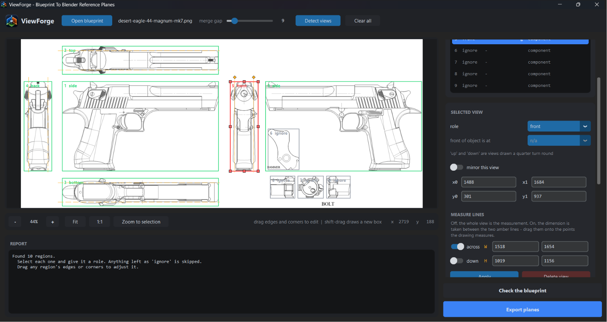
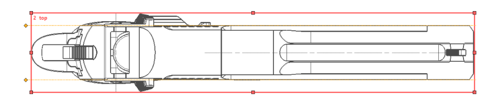
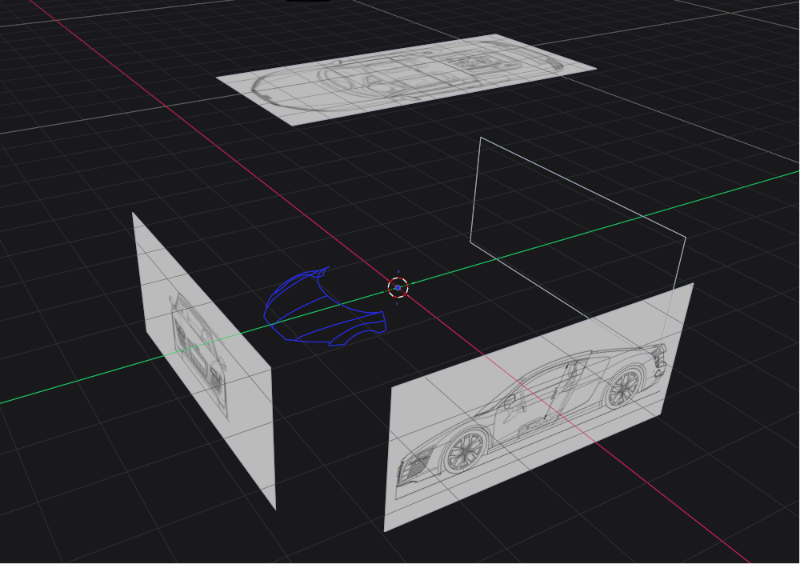

<a href='https://ko-fi.com/I3I01ADVKL' target='_blank'></a>

# ViewForge

Turns a multi-view blueprint into orthographic reference planes that actually
line up in Blender, and prints the numbers to place them with.

Point it at a drawing with a side, top and front view on it. Tell it which is
which and how big the object is. It writes one PNG per view, all on a shared
canvas, plus a Blender script that builds the planes for you. Then it measures
its own output files and tells you how far off they came out.

- **Every view shares one canvas**, so one Size and one Offset apply to all of
  them and only rotation differs. Per-view Size values are the easiest thing in
  this process to get wrong.
- **It checks its own work.** Extents are re-measured from the written PNGs, not
  from the export's own arithmetic.
- **It does not guess quietly.** A drawing that is out of square, two views that
  disagree about the object's centre line, a measure line left somewhere odd:
  you get told, and nothing is silently corrected on your behalf.

---

## Screenshots



**The main window.** A blueprint loaded, views detected, roles assigned, and the
report showing what the numbers imply.



**Editing a box.** Drag any edge on its own, a corner to move two, or the middle
to move the whole thing.



**The result in Blender.** Planes built by the generated import script, centred
on the world origin and lined up with each other.

---

## Requirements

| | |
|---|---|
| **Python** | 3.9 or newer (developed on 3.14) |
| **OS** | Windows, macOS or Linux |
| **Packages** | `pillow`, `numpy`, `scipy`, `customtkinter` |
| **Tkinter** | Ships with Python on Windows and macOS. On Linux you install it separately, see below. |
| **Blender** | Any version with image empties. The Size figure was verified on 5.2. |

Exact versions are in [`requirements.txt`](requirements.txt).

## Installation

### 1. Get Python

Check what you have:

```bash
python --version
```

If that fails, or reports anything below 3.9, install Python from
[python.org/downloads](https://www.python.org/downloads/). **On Windows, tick
"Add python.exe to PATH"** on the first screen of the installer. Almost every
"python is not recognized" problem starts there.

On Linux you also need Tkinter, which is not a pip package:

```bash
sudo apt install python3-tk        # Debian / Ubuntu
sudo dnf install python3-tkinter   # Fedora
sudo pacman -S tk                  # Arch
```

### 2. Get ViewForge

```bash
git clone https://github.com/micahzgreat/ViewForge.git
cd ViewForge
```

Or download the ZIP from the green **Code** button and extract it.

### 3. Install the packages

A virtual environment keeps these out of your system Python. Recommended, not
required.

**Windows (PowerShell):**

```powershell
python -m venv .venv
.\.venv\Scripts\Activate.ps1
pip install -r requirements.txt
```

If PowerShell blocks the activate script, allow it for this user once:
`Set-ExecutionPolicy -Scope CurrentUser RemoteSigned`

**macOS / Linux:**

```bash
python3 -m venv .venv
source .venv/bin/activate
pip install -r requirements.txt
```

**Without a virtual environment**, just the last line on its own is enough.

### 4. Run it

```bash
python viewforge_gui.py
```

You should get a dark window with a **ViewForge** logo in the top left. If
Python starts and nothing appears, Tkinter is missing. See step 1.

---

## Workflow

1. **Open blueprint.** Any image with several views of one object on it.
2. **Detect views.** Each blob of ink becomes a candidate region. If the tool
   says it merged everything into one region, the blueprint's dimension lines
   are joining the views together. Pull the boxes apart by hand, or draw your
   own.
3. **Adjust the boxes.** Every box is editable, detected ones included.
4. **Assign roles.** Select each region, set its role (side / top / bottom /
   front / back), and say which edge the object's **front** sits against.
   Anything left on `ignore` is skipped, which is how you exclude detail insets,
   title blocks and parts diagrams.
5. **Enter dimensions.** Length, width and height in mm. Or switch on
   **proportional only** and skip them entirely.
6. **Check the blueprint.** Read the warnings before exporting.
7. **Export planes.** Pick a folder. Everything lands in it.

## Controls

Click the canvas once so it has keyboard focus.

| Action | Control |
|---|---|
| Draw a new box | Drag on empty paper |
| Draw a box **over** an existing one | **Shift** + drag |
| Move one edge | Drag that edge |
| Move a corner (two edges at once) | Drag that corner |
| Move a whole box | Drag the middle of the **selected** box |
| Move a measure line | Drag its amber diamond |
| Select a view | Click it, or click its row in the list |
| Delete the selected view | **Delete** |
| Zoom | Wheel, or **+** / **-** |
| Pan | Middle-drag, right-drag, **Ctrl**+drag, or arrow keys |
| Fit to window | **F** |

## Editing boxes

Handles appear on the selected box: four corners, four edge midpoints. The
pointer changes shape over each one.

Editing an **auto-detected** region turns it into a hand box, and the report
says so when it happens. It has to. A detected region measures its own blob of
ink and ignores its rectangle, so a rectangle you had just dragged would have
done nothing at all. Once it is a box, the rectangle is the measurement.

For a hand-drawn box **the box is the measurement**. Put its edges exactly on
the object's extremes, because the tool takes the box width as your stated
length and the box height as your stated height. Ink outside the box is clipped,
which is how you keep annotation text and neighbouring views out.

Edges pushed past the edge of the blueprint get pulled back onto it. They cannot
be left there. An edge hanging off the image would be measured at its stated
position while only the ink inside it actually got used, and that is a scale
error with nothing on screen to reveal it.

## Measure lines

Sometimes the figure on the drawing is not taken between the object's extremes.
It is a shoulder, a bore centre, a face set back from the silhouette. Boxing the
object gives you the right picture and the wrong scale. Boxing the measured
points gives you the right scale and throws away the rest of the view.

Switch on **measure lines** for the selected view and you get both. Two amber
guides appear on the axis you asked for. Drag them onto the two points your
dimension is actually taken between. The stated dimension now refers to the gap
between the lines, and the exported plane still shows the whole view running
past them.

- They start out sitting exactly on the box edges, so switching them on changes
  nothing until you move one.
- Their grab handles are the amber diamonds just outside the box, so a measure
  line sitting on top of a box edge is still separately grabbable.
- They are marks on the drawing, so moving a box **edge** leaves them where they
  are. Moving the **whole box** brings them along.
- A line that ends up outside its own box is allowed, but you get a warning. It
  is far more often a leftover than an intention.

The views list marks a gauged view with `g` (across) and `G` (down).

## Views drawn the wrong way round

**front of object is at** takes `left`, `right`, `up` and `down`. The first two
are the ordinary cases. `up` and `down` are for a view drawn a quarter turn
round, where the object's length runs down the image instead of across it. The
tool swaps which of your three dimensions it measures on which image axis, and
rotates the plane to match in Blender.

The control is switched off for **front** and **back** views. On those the
object's front faces the viewer, so the question has no answer, and a live
dropdown there would only invite a setting that does nothing.

> A front or back view that is itself drawn a quarter turn round is not
> currently handled.

## No real dimensions

**Proportional only** switches off length, width and height entirely. Sizes come
from the drawing instead. One scale for the whole blueprint, so what you get is
the blueprint's own proportions, with the object scaled so its largest side is
1000 mm. Views measuring the same axis are combined with a median, so one badly
placed box cannot run away with the result. Measure lines still apply.

This is for modelling something accurately and in proportion when its real world
size is not the point. Everything lines up in Blender exactly as it otherwise
would. Nothing in the export is a measurement, and the report says so rather
than leaving a set of authoritative-looking millimetres lying around.

## Output settings

**detail.** `normal` gives roughly one exported pixel per pixel of the
blueprint, which is about all a scan can justify. `draft` halves it, `fine`
doubles it. The canvas is held between 500 and 6000 px, so neither a wall-sized
drawing nor a thumbnail-sized object produces something unusable. Margin is not
a setting. It is fixed just above 1.0, and the canvas grows on its own whenever
centring a view would otherwise push it over the edge.

**scaling.** `fit` stretches each axis of each view independently to hit your
numbers exactly, so the planes always line up. `uniform` keeps one scale per
view, so circles stay round and any disagreement between views stays visible
instead of being hidden. Use `uniform` when the object has round parts you must
model, like wheels or bores. Use `fit` when alignment matters more than fidelity
to the drawing.

## What gets exported

| File | What it is |
|---|---|
| `side_left.png`, `top_up.png`, and so on | One plane per assigned view, all on the same canvas |
| `viewforge_import.py` | Run it in Blender and it builds every plane for you |
| `report.txt` | Placement numbers, warnings, and the verification pass |
| `placement.json` | The same data as `report.txt`, for scripting |

## Blender

```
Blender > Scripting tab > Open > viewforge_import.py > Run Script
```

or `blender --python viewforge_import.py` from a terminal. It finds the PNGs in
its own folder, so keep them together. Move the whole folder and it still works.

Running it twice is safe. It clears its previous collection first rather than
stacking a second set of planes on the first, which is the usual way to end up
with two exports mixed together.

There is a settings block at the top for opacity, draw depth, whether the planes
are locked against being dragged, and whether each one only appears in its own
orthographic view. The planes are created locked. Unlock in the N-panel or set
`LOCK = False`.

If you would rather place them by hand, `report.txt` lists every rotation and
location. The object ends up centred on the world origin: length on Y with the
front at -Y, width on X, height on Z.

> The Size figure is the canvas's **longer** side in metres. That is measured,
> not assumed. An image empty is drawn with its larger pixel dimension equal to
> `Size`, checked in Blender 5.2 by rendering a 636x1272 empty at `Size 0.5`
> through a 1.0-unit orthographic camera. It came out 99x199 px in a 400 px
> frame, not 200x400.

**Press Numpad 5 before checking anything.** Reference planes never line up in
perspective view, and that alone accounts for a good share of "my blueprint is
broken".

## Reading the report

Two numbers get reported, and confusing them will mislead you:

- **Export error.** How far each file is from what the chosen mode set out to
  produce. This is the tool grading itself, and it should be about a pixel.
- **Deviation from the expected extent.** In `fit` mode this matches the above.
  In `uniform` mode it is meant to be non-zero. It is the drawing's own
  inconsistency, left visible on purpose.

Both print in mm **and in canvas pixels**. The pixel figure is the one that
means something. Placing a view rounds to whole pixels twice, so about a pixel
of slop is the floor on what any export can achieve. Tolerances are set from
that rather than from a fixed number of millimetres, which would call a coarse
canvas broken while letting real drift through on a fine one. A figure in mm
would also mean nothing at all in proportional mode.

### Warnings you will actually see

**"Drawn N% out of square".** That view's two dimensions imply two different
scales. Either one of your numbers is wrong or the view really is stretched. A
dimension that measures the wrong feature, like a slide width when you meant the
overall width, shows up here straight away as a very large percentage. This is
also what a missing measure line looks like.

**"Views disagree on scale by N%".** The blueprint is not internally consistent.
`fit` mode will still line the planes up by stretching the worst view that far.
`uniform` mode leaves the mismatch visible.

**"Its mirror line sits N mm off the middle of its box".** Every view is centred
on its box, on every axis, and nothing here has been moved. This is a reading of
the drawing: on `top`, `bottom`, `front` and `back` the tool looks for the line
the view was drawn symmetric about, on the object's width axis wherever that
lands in the image, so it stays right on a view drawn a quarter turn round. If
the view really is symmetric and its mirror line is not in the middle of its
box, then the box is not centred on the object, and the box is what the
measurement is taken from. Move it. If the view is simply not symmetric, which
is the usual answer, ignore this.

**"Views disagree about where the object's mirror line is".** Two views that
share the width axis found their mirror lines in different places. At least one
of their boxes is off centre on W, and that view will sit off the others in
Blender. This is the one to act on.

> Earlier versions *applied* the mirror line, centring each of `top`, `bottom`,
> `front` and `back` on the line found in its own ink. Views sharing the width
> axis were shifted by different amounts, often in opposite directions, by up to
> 5% of a view's span each way, and the planes did not line up. Worse, the
> self-check subtracted the intended shift before measuring, so the export
> graded itself as perfect. Views are now centred on their boxes and the mirror
> line is only reported. If you have exports from before this change, redo them.

**"N pixels of ink inside this region are not part of it".** An auto-detected
region renders from its own blob of ink alone, so detail that floats free of the
outline - a hole, an island of hatching, text sitting inside the view - is its
own region and does not reach the exported plane. Raise the merge gap until it
joins on, or draw a box over the view instead, where everything inside the box
is kept.

**"Touches the canvas edge".** A plane got cut off. Rare, since the canvas
normally grows to prevent it.

## Using the engine without the GUI

`viewforge_core` has no interface and never opens a window, so you can import it
and drive it directly to batch a pile of blueprints.

```python
import viewforge_core as core

gray, ink, threshold = core.load_blueprint("blueprint.png")
views, lab = core.detect_views(ink)

views[0]["role"] = "side"
views[0]["facing"] = "left"
views[1]["role"] = "top"

meta, report = core.export(views, ink, lab,
                           dims={"L": 1200.0, "W": 400.0, "H": 600.0},
                           outdir="planes")
text, worst_mm, problems = core.verify("planes", meta)
print(text)
```

`problems` is a list of strings, empty when every plane checks out. `export()`
takes `px_per_mm=None` by default, meaning work the resolution out from the
drawing. Pass a number to override it. For proportional output, build `dims`
with `core.proportional_dims(views, ink, lab)` and pass `proportional=True`.

## License

MIT. See [LICENSE](LICENSE).
